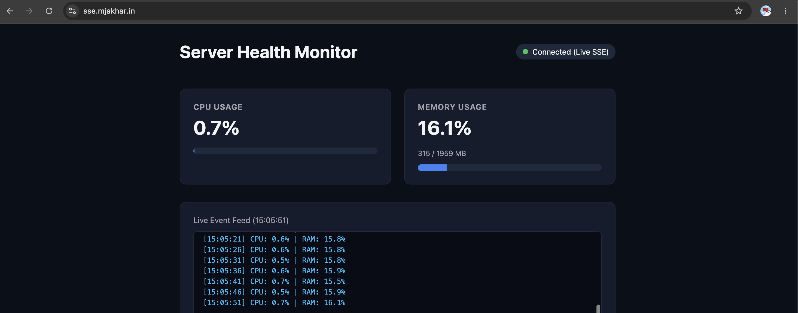

# SSE
This project is to demonstrate SSE(server sent event) concept. 
It exposes a simple dashboard on domain https://sse.mjakhar.in/ to monitor CPU and memory usage of my laptop.

# local env setup

Run docker compose to execute
```bash
docker compose up -d
```

Check logs
```bash
docker compose logs -f
```

Run curl command with -N flag -
```
curl -N http://localhost/api/server-stats
```

Try from browser - [sse](https://sse.mjakhar.in/)



# Generate & Prepare SSL Certificates (Let's Encrypt)
```bash
sudo certbot certonly --manual --preferred-challenges dns -d sse.mjakhar.in
```

Copy certs from default directory to ./certs directory -
```
# Create local certs folder
mkdir -p ./certs

# Copy real certificate files (-L dereferences symlinks)
sudo cp -L /etc/letsencrypt/live/sse.mjakhar.in/fullchain.pem ./certs/
sudo cp -L /etc/letsencrypt/live/sse.mjakhar.in/privkey.pem ./certs/

# Set ownership permissions
sudo chown -R $(whoami) ./certs
```

# Port forwarding

This application is hosted in my laptop. To enable communication from my laptop to domain sse.mjakhar.in , I did the following changes -
1. Static IP allocation - Updated router config to map my system MAC address to a static LAN IP address.
2. Port forwarding - Added 2 port forwarding rule to forward local IP and port to assigned public ip and port. For eg. -
    ```
    192.168.1.9:443 --> 100.190.92.222:443
    ```
